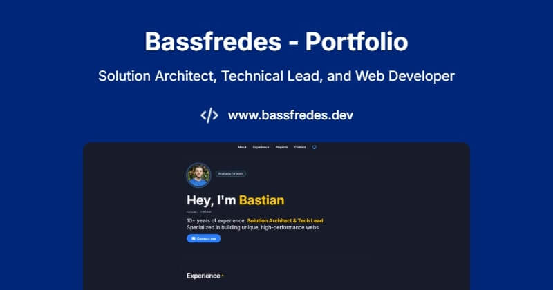

# Portafolio Profesional – Bastian Fredes

Este repositorio contiene el código fuente del portafolio profesional de Bastian Fredes, Solution Architect, Tech Lead y Frontend Developer.

- Sitio: [bassfredes.dev](https://www.bassfredes.dev)
- Tecnologías: Next.js, React, TypeScript, Tailwind CSS
- Navegación SPA con rutas limpias y scroll suave a secciones
- Optimizado para SEO, LLMs y crawlers modernos

## Características
- Línea de tiempo de experiencia profesional
- Proyectos destacados y consistentes visualmente
- Sección de contacto y redes sociales
- Accesibilidad y diseño responsivo
- Sitemap y robots.txt configurados para máxima indexación

---

© 2025 Bastian Fredes
