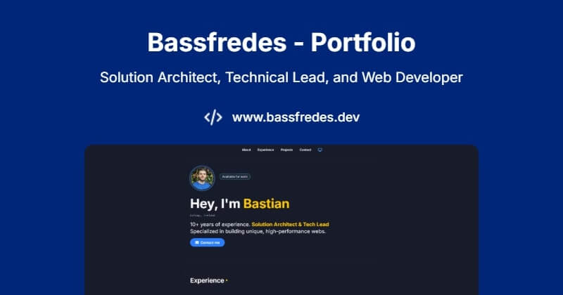

# Portafolio Profesional – Bastian Fredes

Este repositorio contiene el código fuente del portafolio profesional de Bastian Fredes, Solution Architect, Tech Lead y Frontend Developer.

- Sitio: [bassfredes.dev](https://www.bassfredes.dev)
- Tecnologías: Next.js, React, TypeScript, Tailwind CSS
- Navegación SPA con rutas limpias y scroll suave a secciones
- Optimizado para SEO, LLMs y crawlers modernos

## Características
- Línea de tiempo de experiencia profesional
- Proyectos destacados y consistentes visualmente
- Sección de contacto y redes sociales
- Accesibilidad y diseño responsivo
- Sitemap y robots.txt configurados para máxima indexación

---

## Consent Mode v2 and GTM Setup

This project implements Google Consent Mode v2 to manage user consent for analytics and advertising cookies, primarily for Google Tag Manager (GTM) and Google Analytics 4 (GA4).

**Consent Flow:**

*   **Default Consent:** Upon a user's first visit, consent for all categories (`analytics_storage`, `ad_storage`, `ad_user_data`, `ad_personalization`) is defaulted to `denied`. This is handled by the `CookieConsentBanner` component.
*   **Consent Capture:** The cookie consent banner prompts the user for consent. Currently, clicking the "Got it" button implies consent for all categories, setting them to `granted`.
*   **GTM Loading:**
    *   The GTM Container ID is configured using the `NEXT_PUBLIC_GTM_ID` environment variable (e.g., `GTM-T69XG2RH`). See `env.local.example` for setup.
    *   The GTM `<script>` tag is loaded using the Next.js `Script` component (`next/script`) in `AnalyticsScript.tsx`. This loading is conditional and occurs client-side only after the user has granted consent (verified by checking `cookie_consent_given === 'true'` in `localStorage`).
    *   The GTM `<noscript>` tag is included directly in the initial HTML output by `AnalyticsScript.tsx` to provide a tracking fallback for users with JavaScript disabled. In this scenario, GTM loads with default (denied) consent states, as the consent banner and conditional script logic require JavaScript.
*   **GA4 Integration:** Google Analytics 4 is loaded and managed through the GTM container specified by `NEXT_PUBLIC_GTM_ID`.

### Testing and Validation

Thoroughly testing the consent implementation is crucial. Key aspects include verifying default consent states, behavior upon accepting consent, persistence of consent on subsequent visits, and noscript functionality.

For detailed step-by-step manual testing instructions, please see the [manual_testing_instructions.md](manual_testing_instructions.md) file in this repository.

---

© 2025 Bastian Fredes
